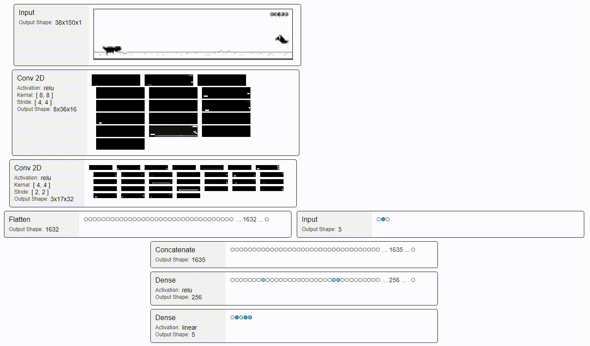

 # Chrome Dino AI
 
AI bot that learns to play the offline dinosaur game in Chrome.

 # Install
 `pip install -r requirements.txt`
 
 On windows you can optionally install `win32gui` which will automatically focus the chrome window. Download the `.whl` file for your python version and architecture from [https://www.lfd.uci.edu/~gohlke/pythonlibs/#pywin32](https://www.lfd.uci.edu/~gohlke/pythonlibs/#pywin32) and install it with `pip install pywin32‑224‑cp36‑cp36m‑win_amd64.whl`
 
 # Run
 
 - open chrome dev tools and "undock in separate window"
 - Select the offline checkbox in the dev tools
 - try to go to a website and put chrome in full screen
    - If you installed `win32gui` then go to [https://github.com](https://github.com). It will look for this in the window title if there are multiple chrome windows open.
 - run `python dino_bot.py`
 - click on the chrome window so the bot can send it keyboard input
 - wait a couple days
 - profit
 
 Note: if you have multiple monitors, uncomment the "show image" code in `src/dino_img_util.py` to see which screen the bot is looking at. You can control which monitor it uses by setting `monitor_id` in `dino_bot.py`
 
 
  # References
  - [Beat Atari with Deep Reinforcement Learning!](https://becominghuman.ai/lets-build-an-atari-ai-part-1-dqn-df57e8ff3b26)
  - [Keras plays catch](https://gist.github.com/EderSantana/c7222daa328f0e885093)

 # TODOs / Experiments
 
 - Try DQN improvements outlined here https://medium.freecodecamp.org/improvements-in-deep-q-learning-dueling-double-dqn-prioritized-experience-replay-and-fixed-58b130cc5682
 - use an RNN with stateful=True
   - https://machinelearningmastery.com/cnn-long-short-term-memory-networks/
   - https://stackoverflow.com/questions/43882796/when-does-keras-reset-an-lstm-state
 - Save/Load `random_action_chance` so you can kill the process and pickup where you left off
 - Add ability to train initial model on everything in the memory
 - Compress pixels to binary in the memory (need to use full size image instead of scaled down one so there is no anti-aliasing)
 - Profile game loop. See how high the fps can go
 - See how many duplicate images are in the memory
 - Selectively prefer memories that are surprising to the model
 - Unit test utility functions
 - Move frame rate and timing into GameEnvironment
